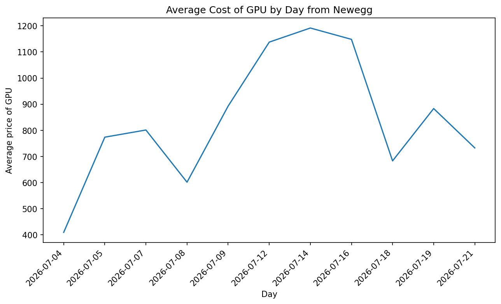

# Newegg PC Component Price Tracker

A few months ago, with the expansion of AI, the consumer memory market saw
a massive jump in cost. One of the major producers of memory switched their
priority to supporting AI data centers, causing major price increases for
everyday consumers. More recently, CPU and GPU prices have started showing
similar signs of pressure. I built this scraper to track RAM, CPU, and GPU
prices from Newegg over time, so I can spot trends and find the best time
to buy.

## Sample Output


## Features
- Scrapes all 20 pages of RAM, CPU, and GPU listings from Newegg across
  three categories
- Extracts product data from Newegg's embedded `__initialState__` JSON
  object rather than fragile HTML parsing
- Persists data in a SQLite database using an UPSERT pattern
  (`INSERT ... ON CONFLICT DO UPDATE`) that tracks `original_price`,
  `current_price`, `price_change_pct`, and `days_tracked` per product
- Filters out non-standalone listings (bundles, prebuilts, accessories)
  per category to keep price data clean
- Schedules automated scrape runs on a configurable interval
- Analyzes accumulated data using SQL aggregate queries, joins, and
  subqueries via pandas
- Generates category-specific charts: price trends over time, top
  brands by listing count, and average price by brand
- Includes SQL VIEWs (`ram_products`, `cpu_products`, `gpu_products`)
  for easy browsing in DB Browser
- Covered by pytest tests using an in-memory SQLite database

## Project Structure
```
WebScraper/
├── config.py       # settings, paths, category URLs, brand market focus
├── scraper.py      # fetches and parses Newegg listings per category
├── database.py     # SQLite schema, UPSERT insert, and query functions
├── main.py         # scheduler entry point, loops through all categories
├── analyzer.py     # SQL aggregate queries via pandas, category-aware
├── visualizer.py   # matplotlib chart generation, category-aware
├── tests/          # pytest test suite
└── requirements.txt
```


## Setup
1. Clone the repository
```bash
    git clone https://github.com/zdowdy/WebScraper.git
```
2. Create and activate a virtual environment
```bash
   python -m venv venv
   venv\Scripts\activate  # Windows
```
3. Install dependencies
```bash
   pip install -r requirements.txt
```
4. Run the scraper
```bash
   python main.py
```
5. Generate charts
```bash
   python visualizer.py
```

## Configuration
In `config.py`:
- `SCRAPE_INTERVAL_HOURS` sets how often the scheduler runs
- `CATEGORIES` maps category names to their Newegg listing URLs
- `BRANDS` maps each brand to a category and market focus
  (consumer / enterprise / both), used for the `JOIN`-based analysis
- `GPU_EXCLUDED_BRANDS` filters out non-GPU accessory listings that
  Newegg mixes into the GPU category page

## Skills Demonstrated

- **Python:** `requests`, `json`, `re`, `schedule`, `logging`, `datetime`, `sqlite3`, `pytest`, `unittest.mock`
- **SQL:** `CREATE TABLE`, `ALTER TABLE`, `INSERT ... ON CONFLICT DO UPDATE` (UPSERT), `CREATE VIEW`, `JOIN`, subqueries, `SELECT`, `WHERE`, `GROUP BY`, `HAVING`, `ORDER BY`, `AVG()`, `COUNT()`, `DATE()`, `ROUND()`
- **Libraries:** pandas, matplotlib
- **Concepts:** JSON extraction from embedded JavaScript, parameterized queries to prevent SQL injection, composite unique constraints, automated scheduling, category-aware data pipelines, data cleaning and validation, data visualization

## Dependencies
- requests==2.34.2
- schedule==1.2.2
- pandas==3.0.3
- matplotlib==3.10.9
- pytest

## Author
Zy Dowdy